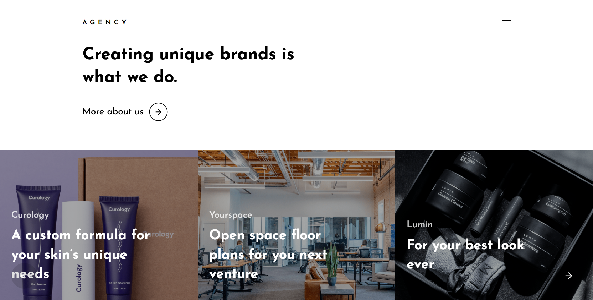

# [React/SCSS/GSAP] Agency Awwwards Landing Page Rebuilt

> Recriation of the [Mel River Agency](https://melriver.com/) throungh Awwwards

[**Demo Site**](https://minimal-article.000webhostapp.com/)

Screenshot: 


---

## 🚀 Quick start

1.  **Clone this repo or simple download it.**

    Clone the master branch of this repo:

    ```shell
    # clone master repo
    git clone -b https://github.com/clovis-rosa/agency_awwwards_rebuilt.git
    ```

2.  **Start developing.**

    Navigate into your new site’s directory and start it up.

    ```shell
    cd agency_awwwards_rebuilt/
    yarn install
    yarn start
    ```

3.  **Open the source code and start editing!**

    Your site is now running at `http://localhost:3000`!


## 🧐 What's inside?

A quick look at the dependencies amd resources:

 - Bootstrapped with [Create React App](https://github.com/facebook/create-react-app).
 - [include-media](https://github.com/eduardoboucas/include-media) Maintainable media queries in SASS


##  💫 Deploying

 - I recommend to use either [Zeit Now](https://now.sh) or [Netlify](https://netlify.com) for hosting your site.


## 📖 License

 - This project is licensed under [the terms of the MIT license](LICENSE).
